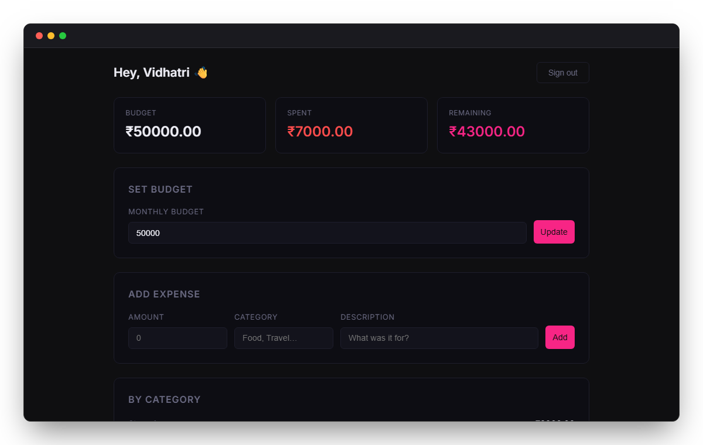
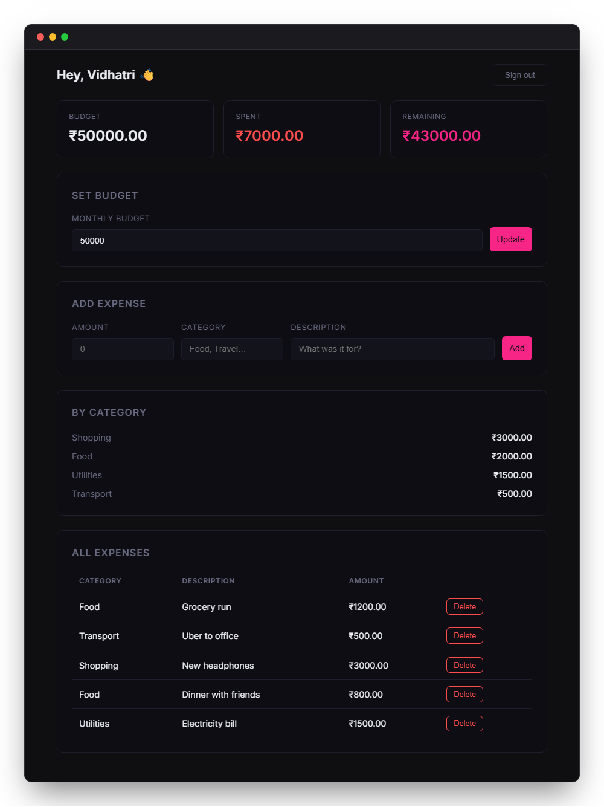
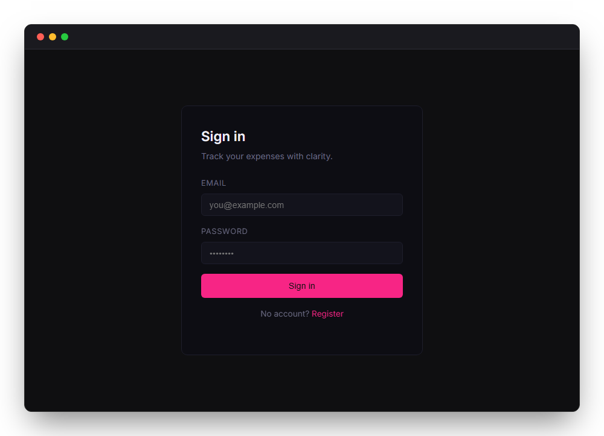

# Personal Expense Tracker

<p align="center">
  
</p>

A full-stack expense tracking application where users can set a monthly budget, log expenses, and view a spending summary.

**Stack:** Flask · SQLite · Vue 3 (Vite)

---

## Project Structure

```
personal-expense-tracker/
├── backend/
│   └── routes/
└── frontend/
    └── src/
        ├── composables/
        ├── router/
        ├── utils/
        └── views/
```

---

## Routes

| Path         | View            | Description                            |
| ------------ | --------------- | -------------------------------------- |
| `/`          | `LoginView`     | Login page                             |
| `/register`  | `RegisterView`  | Registration page                      |
| `/dashboard` | `DashboardView` | Budget, expenses, and spending summary |

### API endpoints

| Method   | URL                  | Description          |
| -------- | -------------------- | -------------------- |
| `POST`   | `/api/register`      | Create account       |
| `POST`   | `/api/login`         | Log in               |
| `POST`   | `/api/logout`        | Log out              |
| `GET`    | `/api/whoami`        | Current user info    |
| `GET`    | `/api/budget`        | Get current budget   |
| `POST`   | `/api/budget`        | Set or update budget |
| `GET`    | `/api/expenses`      | List all expenses    |
| `POST`   | `/api/expenses`      | Add an expense       |
| `DELETE` | `/api/expenses/<id>` | Delete an expense    |

---

## Running the Application

### Backend

```bash
cd backend
pip install -r requirements.txt
python app.py
```

Runs on `http://localhost:5000`. On first run, creates the database and seeds demo data.

### Frontend

```bash
cd frontend
npm install
npm run dev
```

Runs on `http://localhost:5173`.

---

## Screenshots


<br>

